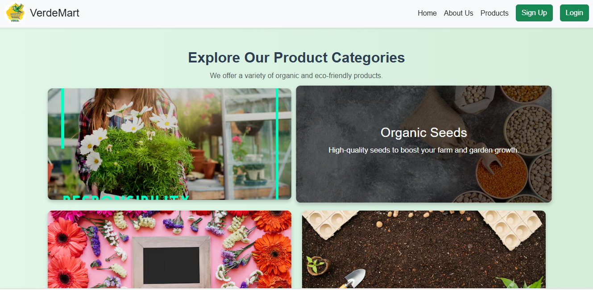

# 🌾 E-Com Agri

A simple e-commerce frontend website for agriculture product listings. Built using **HTML**, **CSS**, and **basic JavaScript** (for dynamic scrolling news ticker).

## ✅ Features

- Clean and responsive layout
- Product listing pages
- Admin section (static)
- Scrolling news ticker
- Works in browser (no backend)

## 💡 How to Use

1. Download or clone this repo
2. Open `index.html` in any web browser

## 🔧 Tech Used

- HTML5  
- CSS3  
- Basic JavaScript

  
  
  
  
## 🔗 Live Demo: [Click here](https://vive-techie.github.io/E-com_Agri/)

---

## 👩‍💻 Author

**Vivetha Subramanian**

- 💼 [LinkedIn](https://linkedin.com/in/vivetha20)
- 💻 [GitHub](https://github.com/vive-techie)
- 📧 vivethasubramanian@gmail.com
